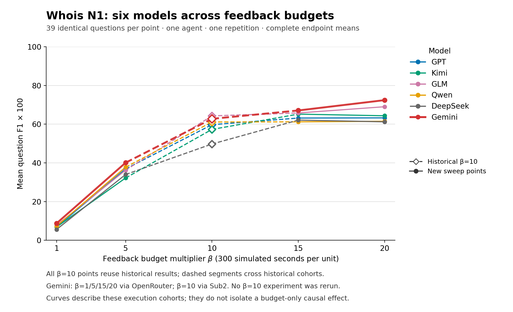

# 六模型 Whois N1 预算补充报告

新结果已齐，独立最终审核通过。保留原五模型 **975** 个位置；新增 Gemini β1/5/15/20 已评分 **156/156**，β10 复用历史 **39/39**，计划共 **1,170** 个位置。每格相同39题、R1、单agent。

| 模型 | β1 | β5 | β10（历史） | β15 | β20 |
|---|---:|---:|---:|---:|---:|
| gpt | 6.84 | 36.87 | 59.75 | 63.17 | 63.27 |
| kimi | 6.84 | 32.19 | 57.30 | 65.20 | 64.35 |
| glm | 7.69 | 36.25 | 64.28 | 65.79 | 69.03 |
| qwen | 7.26 | 37.78 | 61.13 | 61.21 | 61.49 |
| deepseek | 5.56 | 33.99 | 49.75 | 62.11 | 61.21 |
| gemini | 8.72 | 40.09 | 62.77 | 67.09 | 72.43 |

表中为 F1 × 100；CSV 保留 0–1 原值。每格仅在39题全已评分时给完整均值；已知子集均值单独列在 CSV，缺项不补零。

Gemini 新四档来自 OpenRouter `google/gemini-3.8-flash`，β10 来自原 Sub2 Gemini native 服务；模型端点、提供方和日期不同。这条曲线是描述性比较，β10 不是同一部署只改变预算的干预。历史β10没有重跑，其请求/token成本保持未知，不计作零。原五模型也沿用各自原报告的部署边界。

β乘以300为模拟反馈预算秒数；β1/5/10/15/20 对应300/1500/3000/4500/6000秒。N1、Whois39题、R1、seed2200、最多30步/30评价；新执行的具体参数以 hash 绑定 queue plan 和单独 wire 审查为准。N4 不进入该报告。

[逐题输入](inputs/items.csv) · [汇总 CSV](aggregate_metrics.csv) · [Gemini provider/cohort](provider_cohorts.csv) · [相对 β20 差值](budget_differences.csv) · [全部尝试](inputs/attempts.csv) · [输入身份](INPUTS.json) · [守恒检查](CHECKS.json)

聚合重用原冻结函数；原975条逐项字段及25个汇总逐项相等。有效零分保留。token字段未知与零分开；reasoning包含在output中，不能重复相加。此生成器不调用模型、不重新评分、不打开原始请求内容；新 raw 的完整性由单独只读 exporter 收据承接。

首次8个实验已完成模型调用及原评分，因custom预算的v2导出schema不兼容而未生成canonical结果；随后只离线恢复导出，没有重跑这8项。其余148项在schema修复版源码上首次执行。两批执行源码与导出源码分别记在 [逐项采用来源](adoption_sources.csv)，来源manifest和离线验收收据在输入身份链中绑定；不把两种执行源码写成同一个hash。

[独立数值及来源审核](REVIEW_ADOPTION.zh.md) · [机器核验](REVIEW_ADOPTION.json)

[下载 PDF](figures/whois_six_model_budget.pdf) · [下载 SVG](figures/whois_six_model_budget.svg)。所有模型的历史β10使用空心菱形，跨历史点连线用虚线；Gemini新四档为OpenRouter，历史β10为Sub2。

公开包可独立复算：在本目录运行 `python3 -B replay_whois.py --check`，仅用随包CSV核对1,170个位置、30个汇总和24个预算差值，无需原工作目录、raw或网络。绘图源码为 `plot_sweep.py`，使用matplotlib 3.10.8；如重画，请把 `--output-dir` 指向全新目录。

新156项共有1,581次保存的HTTP尝试；原8项的24次请求全部计入。8项原始wall time未记录，保留未知；不能把离线导出的耗时当原模型执行耗时。
