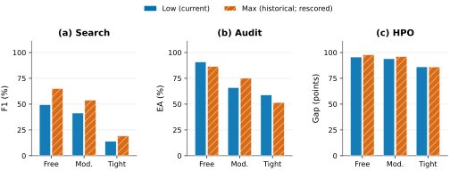

# GLM 完整研究详细报告

> 图件修订版：四张图已重绘，并补充已有数据的 N=1 点；原实验分数、210设置总表及存档保持不变。新增点的口径、英文图注、逐点数据和复现入口见[论文图件说明](FIGURES.zh.md)。原55项复核对应初版成稿，本次图形另作有限复核；原件与公开修订身份见[来源说明](PROVENANCE.md)。

[主报告](README.zh.md) · [210设置总表](metrics/unified_settings.csv) · [417项同版配对](metrics/same_version_pairs.csv) · [12对具体轨迹](TRAJECTORIES.zh.md) · [原917 dump索引](archive/MEMBERS.csv) · [新增Max dump索引](archive/MEMBERS.csv) · [完整分包与恢复入口](ARCHIVES.zh.md)

## 范围与输入契约

这是用户指定矩阵的Custom study，不是run_full.sh默认超集。物理运行如下：

| 组 | 新jobs | agents | 科学位置/配对 |
| --- | --- | --- | --- |
| ExpGym Low N1 | 417 | 417 | 417 |
| Audit scaling Max | 234 | 1248 | 312位置，含78个naive派生位置 |
| Tight N4消融新增 | 266 | 1064 | 总305位置，另39个baseline复用scaling |
| ExpGym同版Max N1 | 417 | 417 | 与Low逐一配对417 |
| 正式合计 | 1334 | 3146 | 科学派生/复用不增加物理成本 |
| 技术验证（独立） | 21 | 63 | 原pilot19/58 + patch2/5 |

417对N1包括Search219（Whois117、Whatis102）、Audit117、HPO81。每预算Search73独立题；Audit13文档×3固定order；HPO9任务×R3（NAS101、NAS201、ParamNet各3任务）。HPO先对agent性能按同task oracle归一化并在0处裁剪，保留高于100的值；逐agent归一并裁剪后，MI取同N池内均值，BoN取最大值；再先任务内平均R3、任务等权。原hist已存Gap直接绑定，不反推raw。没有丢弃零值或把unknown补0。

新正式源码 `88e27ad5963625ccbd3f9269dce0f95412b8d786`，科学tree `2fa93be36614ecf6c29c3cd22f5283a6694e440493da92106f371fb4dab243b5`；执行模型ID `glm-5.3`。Low/Max两层effort分别为low/max，`clear_thinking=false`，两侧都开启thinking；记录的generation temperature=1.0、top_p=0.95、max_tokens=32768。使用native tools，普通决策auto、forced-final none但保留schemas/history；tuning final policy=legacy、missing final policy=task-abstention-v1，完整逐槽参数与数据文件身份位于两个导出的parameters.jsonl。请求层未提供/不适用字段仍为null，不能从默认值推断未记录字段；已记录seed也不证明采样完全可重复。

四TP16副本／64H200，16个并发invocations；Low→ablation→scaling→Max顺序自然drain。每pool固定一个副本，重复和组的输出/cache隔离。Max和Low的417配对经slot/job/data/参数身份核对；实际首请求system/user/tools及双层effort另有固定12对审阅。新Max与Low科学参数匹配，不消除不同运行时间、机器分派和争用的影响。

原917和Max417各一次严格闭合导出，分别30,889与7,109件raw，合计37,998件、5,653,794,117字节。导出issues均0，execution_complete与score_complete均1334/1334。完整请求/响应、usage账本、原结果未改；零分不等于未执行。

## 同版本主要对照

| 指标 | 预算 | Low | 同版本 Max | Low − Max |
| --- | --- | --- | --- | --- |
| Search F1 % | Free | 49.414 | 60.631 | -11.217 |
| Search F1 % | Moderate | 41.318 | 55.658 | -14.341 |
| Search F1 % | Tight | 13.930 | 18.106 | -4.176 |
| Audit EA % | Free | 90.799 | 94.721 | -3.922 |
| Audit EA % | Moderate | 66.063 | 81.750 | -15.686 |
| Audit EA % | Tight | 58.824 | 57.919 | +0.905 |
| HPO Gap | Free | 95.621 | 98.700 | -3.079 |
| HPO Gap | Moderate | 93.970 | 96.295 | -2.325 |
| HPO Gap | Tight | 86.119 | 83.601 | +2.517 |

下表同样保留EA与LA的差异：

| 预算 | Low LA % | Max LA % | Low − Max pp |
| --- | --- | --- | --- |
| Free | 95.324 | 94.570 | +0.754 |
| Moderate | 84.465 | 90.347 | -5.882 |
| Tight | 86.124 | 77.979 | +8.145 |

完整[834个单侧位置](metrics/same_version_positions.csv)、[417配对](metrics/same_version_pairs.csv)、[18个主次比较](metrics/same_version_comparisons.csv)保持同一原分。Low−Max的单槽主指标为负165、正62、相等190，均为描述性统计；不把417个混合任务当同量纲样本做总效应检验。

## Scaling与消融层级

Scaling Moderate/Tight × naive/cached/PoolAct × N2/4/6/8，每设置13文档。naive N8每题28/70/28/1个N2/4/6/8子集，共3302条子集记录；先每子集按原agent ID顺序执行legacy MV，再对同题子集均值，再13题均值。对MI也逐子集按同N计算，没有以N8 MI替代小N。子集依赖共同N8 agents，不是独立重复或新模型采样。

| 预算 | 方法 | N1（个体均分） | N2 | N4 | N6 | N8 |
| --- | --- | --- | --- | --- | --- | --- |
| Moderate | naive | 77.602 | 82.579 | 84.286 | 84.454 | 84.163 |
| Moderate | cached | 未运行 | 86.878 | 90.045 | 92.308 | 91.855 |
| Moderate | poolact | 未运行 | 92.760 | 97.738 | 100.000 | 100.000 |
| Tight | naive | 59.106 | 63.203 | 63.129 | 62.815 | 63.348 |
| Tight | cached | 未运行 | 61.991 | 66.968 | 66.063 | 66.063 |
| Tight | poolact | 未运行 | 64.253 | 80.995 | 87.330 | 92.308 |

N1复用naive N8池中的个体评分均值 EA_MI：每文档8个agent先平均，再13文档等权；N≥2仍为原EA-MV，未重新投票或增加实验。独立ExpGym Max N1为Moderate **81.750%**、Tight **57.919%**，在图中用空心菱形标出；它采用3种order且context/cache设置不同，不作为三条曲线的共同起点。Cached/PoolAct的N1保持未运行。详见[定义与图注](FIGURES.zh.md#n1-的定义与可比性)。

| 指标 | naive | cached | peer_context | graph_no_lock | poolact |
| --- | --- | --- | --- | --- | --- |
| Whois F1-MV % | 19.578 | 18.762 | 23.741 | 20.738 | 31.165 |
| Audit EA-MV % | 63.129 | 66.968 | 71.493 | 76.471 | 80.995 |
| NAS101 Gap-MI | 84.811 | 85.263 | 87.550 | 87.683 | 96.044 |

| 场景 | 相邻比较 | Δ target − baseline |
| --- | --- | --- |
| restricted_search | naive → cached | -0.816 |
| restricted_search | cached → peer_context | +4.979 |
| restricted_search | peer_context → graph_no_lock | -3.004 |
| restricted_search | graph_no_lock → poolact | +10.427 |
| evidence_audit | naive → cached | +3.840 |
| evidence_audit | cached → peer_context | +4.525 |
| evidence_audit | peer_context → graph_no_lock | +4.977 |
| evidence_audit | graph_no_lock → poolact | +4.525 |
| tuning | naive → cached | +0.452 |
| tuning | cached → peer_context | +2.287 |
| tuning | peer_context → graph_no_lock | +0.133 |
| tuning | graph_no_lock → poolact | +8.361 |

Audit五臂13题完整对齐；39baseline位置来自本轮scaling（naive/cached/full各13），其中naive N4是70个子集的均值。Whois39题与NAS101三任务×R3的naive直接N4，不混用推导规则。数据复用关系、原job与位置信息在[305位置](metrics/ablation_positions.csv)、[312位置](metrics/scaling_positions.csv)、[3302子集](metrics/naive_subsets.csv)中保存。成本只计234+266个物理pool一次。

graph_no_lock仅移除整个LLM reasoning/claim外层临界区，内部claims/cache/graph数据结构锁保留。peer_context将其他agent当时已完成且时间可见的完整action/result拼接；graph替换同时改变pending/path/coverage等机制，b→a不能解释成纯格式因素。技术pilot实测full N8的39请求跨agent时间区间重叠0，而六个a/b池103请求有233对重叠；这只是该技术样本的时间证据，非所有正式请求的逐对审计。

## 全设置210行

表中fraction乘100显示，Gap/Gap0保留points，RawPerf保持原performance。`题/任务`与`order/repeat位置`是不同分母；完整mean只有全计划单位齐全才给出，known_mean另存CSV，不以它填补unknown。全部210行当前完整，missing units均0。组成是scaling96、消融60、同版Low/Max36、历史18；历史是次级描述行，不是额外新执行。

| 组 | 场景 | 预算 | 方法 | N | cohort | 指标 | 值 | 已知/计划题或任务 | 已知/计划位置 | 缺位置 |
| --- | --- | --- | --- | --- | --- | --- | --- | --- | --- | --- |
| ablation | evidence_audit | cost_tight | cached | 4 | new | EA_MI | 63.462 | 13/13 | 13/13 | 0 |
| ablation | evidence_audit | cost_tight | cached | 4 | new | EA_MV | 66.968 | 13/13 | 13/13 | 0 |
| ablation | evidence_audit | cost_tight | cached | 4 | new | LA_MI | 84.729 | 13/13 | 13/13 | 0 |
| ablation | evidence_audit | cost_tight | cached | 4 | new | LA_MV | 88.688 | 13/13 | 13/13 | 0 |
| ablation | evidence_audit | cost_tight | graph_no_lock | 4 | new | EA_MI | 64.706 | 13/13 | 13/13 | 0 |
| ablation | evidence_audit | cost_tight | graph_no_lock | 4 | new | EA_MV | 76.471 | 13/13 | 13/13 | 0 |
| ablation | evidence_audit | cost_tight | graph_no_lock | 4 | new | LA_MI | 77.149 | 13/13 | 13/13 | 0 |
| ablation | evidence_audit | cost_tight | graph_no_lock | 4 | new | LA_MV | 91.403 | 13/13 | 13/13 | 0 |
| ablation | evidence_audit | cost_tight | naive | 4 | new | EA_MI | 59.106 | 13/13 | 13/13 | 0 |
| ablation | evidence_audit | cost_tight | naive | 4 | new | EA_MV | 63.129 | 13/13 | 13/13 | 0 |
| ablation | evidence_audit | cost_tight | naive | 4 | new | LA_MI | 82.014 | 13/13 | 13/13 | 0 |
| ablation | evidence_audit | cost_tight | naive | 4 | new | LA_MV | 88.274 | 13/13 | 13/13 | 0 |
| ablation | evidence_audit | cost_tight | peer_context | 4 | new | EA_MI | 63.688 | 13/13 | 13/13 | 0 |
| ablation | evidence_audit | cost_tight | peer_context | 4 | new | EA_MV | 71.493 | 13/13 | 13/13 | 0 |
| ablation | evidence_audit | cost_tight | peer_context | 4 | new | LA_MI | 81.561 | 13/13 | 13/13 | 0 |
| ablation | evidence_audit | cost_tight | peer_context | 4 | new | LA_MV | 91.403 | 13/13 | 13/13 | 0 |
| ablation | evidence_audit | cost_tight | poolact | 4 | new | EA_MI | 67.873 | 13/13 | 13/13 | 0 |
| ablation | evidence_audit | cost_tight | poolact | 4 | new | EA_MV | 80.995 | 13/13 | 13/13 | 0 |
| ablation | evidence_audit | cost_tight | poolact | 4 | new | LA_MI | 77.715 | 13/13 | 13/13 | 0 |
| ablation | evidence_audit | cost_tight | poolact | 4 | new | LA_MV | 94.118 | 13/13 | 13/13 | 0 |
| ablation | restricted_search | cost_tight | cached | 4 | new | F1_MI | 18.812 | 39/39 | 39/39 | 0 |
| ablation | restricted_search | cost_tight | cached | 4 | new | F1_MV | 18.762 | 39/39 | 39/39 | 0 |
| ablation | restricted_search | cost_tight | graph_no_lock | 4 | new | F1_MI | 20.549 | 39/39 | 39/39 | 0 |
| ablation | restricted_search | cost_tight | graph_no_lock | 4 | new | F1_MV | 20.738 | 39/39 | 39/39 | 0 |
| ablation | restricted_search | cost_tight | naive | 4 | new | F1_MI | 18.253 | 39/39 | 39/39 | 0 |
| ablation | restricted_search | cost_tight | naive | 4 | new | F1_MV | 19.578 | 39/39 | 39/39 | 0 |
| ablation | restricted_search | cost_tight | peer_context | 4 | new | F1_MI | 23.769 | 39/39 | 39/39 | 0 |
| ablation | restricted_search | cost_tight | peer_context | 4 | new | F1_MV | 23.741 | 39/39 | 39/39 | 0 |
| ablation | restricted_search | cost_tight | poolact | 4 | new | F1_MI | 25.933 | 39/39 | 39/39 | 0 |
| ablation | restricted_search | cost_tight | poolact | 4 | new | F1_MV | 31.165 | 39/39 | 39/39 | 0 |
| ablation | tuning | cost_tight | cached | 4 | new | Gap0_BoN | 93.075 | 3/3 | 9/9 | 0 |
| ablation | tuning | cost_tight | cached | 4 | new | Gap0_MI | 85.263 | 3/3 | 9/9 | 0 |
| ablation | tuning | cost_tight | cached | 4 | new | Gap_BoN | 93.075 | 3/3 | 9/9 | 0 |
| ablation | tuning | cost_tight | cached | 4 | new | Gap_MI | 85.263 | 3/3 | 9/9 | 0 |
| ablation | tuning | cost_tight | cached | 4 | new | RawPerf_BoN | 90.626 | 3/3 | 9/9 | 0 |
| ablation | tuning | cost_tight | cached | 4 | new | RawPerf_MI | 87.057 | 3/3 | 9/9 | 0 |
| ablation | tuning | cost_tight | graph_no_lock | 4 | new | Gap0_BoN | 97.644 | 3/3 | 9/9 | 0 |
| ablation | tuning | cost_tight | graph_no_lock | 4 | new | Gap0_MI | 87.683 | 3/3 | 9/9 | 0 |
| ablation | tuning | cost_tight | graph_no_lock | 4 | new | Gap_BoN | 97.644 | 3/3 | 9/9 | 0 |
| ablation | tuning | cost_tight | graph_no_lock | 4 | new | Gap_MI | 87.683 | 3/3 | 9/9 | 0 |
| ablation | tuning | cost_tight | graph_no_lock | 4 | new | RawPerf_BoN | 93.617 | 3/3 | 9/9 | 0 |
| ablation | tuning | cost_tight | graph_no_lock | 4 | new | RawPerf_MI | 87.856 | 3/3 | 9/9 | 0 |
| ablation | tuning | cost_tight | naive | 4 | new | Gap0_BoN | 94.082 | 3/3 | 9/9 | 0 |
| ablation | tuning | cost_tight | naive | 4 | new | Gap0_MI | 84.811 | 3/3 | 9/9 | 0 |
| ablation | tuning | cost_tight | naive | 4 | new | Gap_BoN | 94.082 | 3/3 | 9/9 | 0 |
| ablation | tuning | cost_tight | naive | 4 | new | Gap_MI | 84.811 | 3/3 | 9/9 | 0 |
| ablation | tuning | cost_tight | naive | 4 | new | RawPerf_BoN | 91.539 | 3/3 | 9/9 | 0 |
| ablation | tuning | cost_tight | naive | 4 | new | RawPerf_MI | 88.190 | 3/3 | 9/9 | 0 |
| ablation | tuning | cost_tight | peer_context | 4 | new | Gap0_BoN | 93.339 | 3/3 | 9/9 | 0 |
| ablation | tuning | cost_tight | peer_context | 4 | new | Gap0_MI | 87.550 | 3/3 | 9/9 | 0 |
| ablation | tuning | cost_tight | peer_context | 4 | new | Gap_BoN | 93.339 | 3/3 | 9/9 | 0 |
| ablation | tuning | cost_tight | peer_context | 4 | new | Gap_MI | 87.550 | 3/3 | 9/9 | 0 |
| ablation | tuning | cost_tight | peer_context | 4 | new | RawPerf_BoN | 91.355 | 3/3 | 9/9 | 0 |
| ablation | tuning | cost_tight | peer_context | 4 | new | RawPerf_MI | 89.014 | 3/3 | 9/9 | 0 |
| ablation | tuning | cost_tight | poolact | 4 | new | Gap0_BoN | 98.337 | 3/3 | 9/9 | 0 |
| ablation | tuning | cost_tight | poolact | 4 | new | Gap0_MI | 96.044 | 3/3 | 9/9 | 0 |
| ablation | tuning | cost_tight | poolact | 4 | new | Gap_BoN | 98.337 | 3/3 | 9/9 | 0 |
| ablation | tuning | cost_tight | poolact | 4 | new | Gap_MI | 96.044 | 3/3 | 9/9 | 0 |
| ablation | tuning | cost_tight | poolact | 4 | new | RawPerf_BoN | 93.926 | 3/3 | 9/9 | 0 |
| ablation | tuning | cost_tight | poolact | 4 | new | RawPerf_MI | 92.652 | 3/3 | 9/9 | 0 |
| scaling | evidence_audit | cost_moderate | cached | 2 | new | EA_MI | 81.448 | 13/13 | 13/13 | 0 |
| scaling | evidence_audit | cost_moderate | cached | 2 | new | EA_MV | 86.878 | 13/13 | 13/13 | 0 |
| scaling | evidence_audit | cost_moderate | cached | 2 | new | LA_MI | 89.593 | 13/13 | 13/13 | 0 |
| scaling | evidence_audit | cost_moderate | cached | 2 | new | LA_MV | 94.118 | 13/13 | 13/13 | 0 |
| scaling | evidence_audit | cost_moderate | cached | 4 | new | EA_MI | 85.294 | 13/13 | 13/13 | 0 |
| scaling | evidence_audit | cost_moderate | cached | 4 | new | EA_MV | 90.045 | 13/13 | 13/13 | 0 |
| scaling | evidence_audit | cost_moderate | cached | 4 | new | LA_MI | 92.081 | 13/13 | 13/13 | 0 |
| scaling | evidence_audit | cost_moderate | cached | 4 | new | LA_MV | 94.570 | 13/13 | 13/13 | 0 |
| scaling | evidence_audit | cost_moderate | cached | 6 | new | EA_MI | 79.186 | 13/13 | 13/13 | 0 |
| scaling | evidence_audit | cost_moderate | cached | 6 | new | EA_MV | 92.308 | 13/13 | 13/13 | 0 |
| scaling | evidence_audit | cost_moderate | cached | 6 | new | LA_MI | 84.087 | 13/13 | 13/13 | 0 |
| scaling | evidence_audit | cost_moderate | cached | 6 | new | LA_MV | 95.475 | 13/13 | 13/13 | 0 |
| scaling | evidence_audit | cost_moderate | cached | 8 | new | EA_MI | 81.787 | 13/13 | 13/13 | 0 |
| scaling | evidence_audit | cost_moderate | cached | 8 | new | EA_MV | 91.855 | 13/13 | 13/13 | 0 |
| scaling | evidence_audit | cost_moderate | cached | 8 | new | LA_MI | 86.143 | 13/13 | 13/13 | 0 |
| scaling | evidence_audit | cost_moderate | cached | 8 | new | LA_MV | 95.475 | 13/13 | 13/13 | 0 |
| scaling | evidence_audit | cost_moderate | naive | 2 | new | EA_MI | 77.602 | 13/13 | 13/13 | 0 |
| scaling | evidence_audit | cost_moderate | naive | 2 | new | EA_MV | 82.579 | 13/13 | 13/13 | 0 |
| scaling | evidence_audit | cost_moderate | naive | 2 | new | LA_MI | 86.765 | 13/13 | 13/13 | 0 |
| scaling | evidence_audit | cost_moderate | naive | 2 | new | LA_MV | 92.259 | 13/13 | 13/13 | 0 |
| scaling | evidence_audit | cost_moderate | naive | 4 | new | EA_MI | 77.602 | 13/13 | 13/13 | 0 |
| scaling | evidence_audit | cost_moderate | naive | 4 | new | EA_MV | 84.286 | 13/13 | 13/13 | 0 |
| scaling | evidence_audit | cost_moderate | naive | 4 | new | LA_MI | 86.765 | 13/13 | 13/13 | 0 |
| scaling | evidence_audit | cost_moderate | naive | 4 | new | LA_MV | 93.167 | 13/13 | 13/13 | 0 |
| scaling | evidence_audit | cost_moderate | naive | 6 | new | EA_MI | 77.602 | 13/13 | 13/13 | 0 |
| scaling | evidence_audit | cost_moderate | naive | 6 | new | EA_MV | 84.454 | 13/13 | 13/13 | 0 |
| scaling | evidence_audit | cost_moderate | naive | 6 | new | LA_MI | 86.765 | 13/13 | 13/13 | 0 |
| scaling | evidence_audit | cost_moderate | naive | 6 | new | LA_MV | 93.180 | 13/13 | 13/13 | 0 |
| scaling | evidence_audit | cost_moderate | naive | 8 | new | EA_MI | 77.602 | 13/13 | 13/13 | 0 |
| scaling | evidence_audit | cost_moderate | naive | 8 | new | EA_MV | 84.163 | 13/13 | 13/13 | 0 |
| scaling | evidence_audit | cost_moderate | naive | 8 | new | LA_MI | 86.765 | 13/13 | 13/13 | 0 |
| scaling | evidence_audit | cost_moderate | naive | 8 | new | LA_MV | 93.213 | 13/13 | 13/13 | 0 |
| scaling | evidence_audit | cost_moderate | poolact | 2 | new | EA_MI | 89.367 | 13/13 | 13/13 | 0 |
| scaling | evidence_audit | cost_moderate | poolact | 2 | new | EA_MV | 92.760 | 13/13 | 13/13 | 0 |
| scaling | evidence_audit | cost_moderate | poolact | 2 | new | LA_MI | 92.308 | 13/13 | 13/13 | 0 |
| scaling | evidence_audit | cost_moderate | poolact | 2 | new | LA_MV | 95.928 | 13/13 | 13/13 | 0 |
| scaling | evidence_audit | cost_moderate | poolact | 4 | new | EA_MI | 89.027 | 13/13 | 13/13 | 0 |
| scaling | evidence_audit | cost_moderate | poolact | 4 | new | EA_MV | 97.738 | 13/13 | 13/13 | 0 |
| scaling | evidence_audit | cost_moderate | poolact | 4 | new | LA_MI | 90.045 | 13/13 | 13/13 | 0 |
| scaling | evidence_audit | cost_moderate | poolact | 4 | new | LA_MV | 97.738 | 13/13 | 13/13 | 0 |
| scaling | evidence_audit | cost_moderate | poolact | 6 | new | EA_MI | 92.232 | 13/13 | 13/13 | 0 |
| scaling | evidence_audit | cost_moderate | poolact | 6 | new | EA_MV | 100.000 | 13/13 | 13/13 | 0 |
| scaling | evidence_audit | cost_moderate | poolact | 6 | new | LA_MI | 91.780 | 13/13 | 13/13 | 0 |
| scaling | evidence_audit | cost_moderate | poolact | 6 | new | LA_MV | 98.190 | 13/13 | 13/13 | 0 |
| scaling | evidence_audit | cost_moderate | poolact | 8 | new | EA_MI | 96.154 | 13/13 | 13/13 | 0 |
| scaling | evidence_audit | cost_moderate | poolact | 8 | new | EA_MV | 100.000 | 13/13 | 13/13 | 0 |
| scaling | evidence_audit | cost_moderate | poolact | 8 | new | LA_MI | 93.835 | 13/13 | 13/13 | 0 |
| scaling | evidence_audit | cost_moderate | poolact | 8 | new | LA_MV | 98.190 | 13/13 | 13/13 | 0 |
| scaling | evidence_audit | cost_tight | cached | 2 | new | EA_MI | 59.729 | 13/13 | 13/13 | 0 |
| scaling | evidence_audit | cost_tight | cached | 2 | new | EA_MV | 61.991 | 13/13 | 13/13 | 0 |
| scaling | evidence_audit | cost_tight | cached | 2 | new | LA_MI | 84.615 | 13/13 | 13/13 | 0 |
| scaling | evidence_audit | cost_tight | cached | 2 | new | LA_MV | 88.235 | 13/13 | 13/13 | 0 |
| scaling | evidence_audit | cost_tight | cached | 4 | new | EA_MI | 63.462 | 13/13 | 13/13 | 0 |
| scaling | evidence_audit | cost_tight | cached | 4 | new | EA_MV | 66.968 | 13/13 | 13/13 | 0 |
| scaling | evidence_audit | cost_tight | cached | 4 | new | LA_MI | 84.729 | 13/13 | 13/13 | 0 |
| scaling | evidence_audit | cost_tight | cached | 4 | new | LA_MV | 88.688 | 13/13 | 13/13 | 0 |
| scaling | evidence_audit | cost_tight | cached | 6 | new | EA_MI | 63.273 | 13/13 | 13/13 | 0 |
| scaling | evidence_audit | cost_tight | cached | 6 | new | EA_MV | 66.063 | 13/13 | 13/13 | 0 |
| scaling | evidence_audit | cost_tight | cached | 6 | new | LA_MI | 84.917 | 13/13 | 13/13 | 0 |
| scaling | evidence_audit | cost_tight | cached | 6 | new | LA_MV | 90.045 | 13/13 | 13/13 | 0 |
| scaling | evidence_audit | cost_tight | cached | 8 | new | EA_MI | 62.048 | 13/13 | 13/13 | 0 |
| scaling | evidence_audit | cost_tight | cached | 8 | new | EA_MV | 66.063 | 13/13 | 13/13 | 0 |
| scaling | evidence_audit | cost_tight | cached | 8 | new | LA_MI | 82.523 | 13/13 | 13/13 | 0 |
| scaling | evidence_audit | cost_tight | cached | 8 | new | LA_MV | 89.593 | 13/13 | 13/13 | 0 |
| scaling | evidence_audit | cost_tight | naive | 2 | new | EA_MI | 59.106 | 13/13 | 13/13 | 0 |
| scaling | evidence_audit | cost_tight | naive | 2 | new | EA_MV | 63.203 | 13/13 | 13/13 | 0 |
| scaling | evidence_audit | cost_tight | naive | 2 | new | LA_MI | 82.014 | 13/13 | 13/13 | 0 |
| scaling | evidence_audit | cost_tight | naive | 2 | new | LA_MV | 87.492 | 13/13 | 13/13 | 0 |
| scaling | evidence_audit | cost_tight | naive | 4 | new | EA_MI | 59.106 | 13/13 | 13/13 | 0 |
| scaling | evidence_audit | cost_tight | naive | 4 | new | EA_MV | 63.129 | 13/13 | 13/13 | 0 |
| scaling | evidence_audit | cost_tight | naive | 4 | new | LA_MI | 82.014 | 13/13 | 13/13 | 0 |
| scaling | evidence_audit | cost_tight | naive | 4 | new | LA_MV | 88.274 | 13/13 | 13/13 | 0 |
| scaling | evidence_audit | cost_tight | naive | 6 | new | EA_MI | 59.106 | 13/13 | 13/13 | 0 |
| scaling | evidence_audit | cost_tight | naive | 6 | new | EA_MV | 62.815 | 13/13 | 13/13 | 0 |
| scaling | evidence_audit | cost_tight | naive | 6 | new | LA_MI | 82.014 | 13/13 | 13/13 | 0 |
| scaling | evidence_audit | cost_tight | naive | 6 | new | LA_MV | 88.251 | 13/13 | 13/13 | 0 |
| scaling | evidence_audit | cost_tight | naive | 8 | new | EA_MI | 59.106 | 13/13 | 13/13 | 0 |
| scaling | evidence_audit | cost_tight | naive | 8 | new | EA_MV | 63.348 | 13/13 | 13/13 | 0 |
| scaling | evidence_audit | cost_tight | naive | 8 | new | LA_MI | 82.014 | 13/13 | 13/13 | 0 |
| scaling | evidence_audit | cost_tight | naive | 8 | new | LA_MV | 88.688 | 13/13 | 13/13 | 0 |
| scaling | evidence_audit | cost_tight | poolact | 2 | new | EA_MI | 63.122 | 13/13 | 13/13 | 0 |
| scaling | evidence_audit | cost_tight | poolact | 2 | new | EA_MV | 64.253 | 13/13 | 13/13 | 0 |
| scaling | evidence_audit | cost_tight | poolact | 2 | new | LA_MI | 79.638 | 13/13 | 13/13 | 0 |
| scaling | evidence_audit | cost_tight | poolact | 2 | new | LA_MV | 82.805 | 13/13 | 13/13 | 0 |
| scaling | evidence_audit | cost_tight | poolact | 4 | new | EA_MI | 67.873 | 13/13 | 13/13 | 0 |
| scaling | evidence_audit | cost_tight | poolact | 4 | new | EA_MV | 80.995 | 13/13 | 13/13 | 0 |
| scaling | evidence_audit | cost_tight | poolact | 4 | new | LA_MI | 77.715 | 13/13 | 13/13 | 0 |
| scaling | evidence_audit | cost_tight | poolact | 4 | new | LA_MV | 94.118 | 13/13 | 13/13 | 0 |
| scaling | evidence_audit | cost_tight | poolact | 6 | new | EA_MI | 80.090 | 13/13 | 13/13 | 0 |
| scaling | evidence_audit | cost_tight | poolact | 6 | new | EA_MV | 87.330 | 13/13 | 13/13 | 0 |
| scaling | evidence_audit | cost_tight | poolact | 6 | new | LA_MI | 87.255 | 13/13 | 13/13 | 0 |
| scaling | evidence_audit | cost_tight | poolact | 6 | new | LA_MV | 95.023 | 13/13 | 13/13 | 0 |
| scaling | evidence_audit | cost_tight | poolact | 8 | new | EA_MI | 82.975 | 13/13 | 13/13 | 0 |
| scaling | evidence_audit | cost_tight | poolact | 8 | new | EA_MV | 92.308 | 13/13 | 13/13 | 0 |
| scaling | evidence_audit | cost_tight | poolact | 8 | new | LA_MI | 86.652 | 13/13 | 13/13 | 0 |
| scaling | evidence_audit | cost_tight | poolact | 8 | new | LA_MV | 96.380 | 13/13 | 13/13 | 0 |
| thinking_same_version | evidence_audit | cost_free | single | 1 | same_version_low | EA | 90.799 | 13/13 | 39/39 | 0 |
| thinking_same_version | evidence_audit | cost_free | single | 1 | same_version_low | LA | 95.324 | 13/13 | 39/39 | 0 |
| thinking_same_version | evidence_audit | cost_free | single | 1 | same_version_max | EA | 94.721 | 13/13 | 39/39 | 0 |
| thinking_same_version | evidence_audit | cost_free | single | 1 | same_version_max | LA | 94.570 | 13/13 | 39/39 | 0 |
| thinking_same_version | evidence_audit | cost_moderate | single | 1 | same_version_low | EA | 66.063 | 13/13 | 39/39 | 0 |
| thinking_same_version | evidence_audit | cost_moderate | single | 1 | same_version_low | LA | 84.465 | 13/13 | 39/39 | 0 |
| thinking_same_version | evidence_audit | cost_moderate | single | 1 | same_version_max | EA | 81.750 | 13/13 | 39/39 | 0 |
| thinking_same_version | evidence_audit | cost_moderate | single | 1 | same_version_max | LA | 90.347 | 13/13 | 39/39 | 0 |
| thinking_same_version | evidence_audit | cost_tight | single | 1 | same_version_low | EA | 58.824 | 13/13 | 39/39 | 0 |
| thinking_same_version | evidence_audit | cost_tight | single | 1 | same_version_low | LA | 86.124 | 13/13 | 39/39 | 0 |
| thinking_same_version | evidence_audit | cost_tight | single | 1 | same_version_max | EA | 57.919 | 13/13 | 39/39 | 0 |
| thinking_same_version | evidence_audit | cost_tight | single | 1 | same_version_max | LA | 77.979 | 13/13 | 39/39 | 0 |
| thinking_same_version | restricted_search | cost_free | single | 1 | same_version_low | F1 | 49.414 | 73/73 | 73/73 | 0 |
| thinking_same_version | restricted_search | cost_free | single | 1 | same_version_max | F1 | 60.631 | 73/73 | 73/73 | 0 |
| thinking_same_version | restricted_search | cost_moderate | single | 1 | same_version_low | F1 | 41.318 | 73/73 | 73/73 | 0 |
| thinking_same_version | restricted_search | cost_moderate | single | 1 | same_version_max | F1 | 55.658 | 73/73 | 73/73 | 0 |
| thinking_same_version | restricted_search | cost_tight | single | 1 | same_version_low | F1 | 13.930 | 73/73 | 73/73 | 0 |
| thinking_same_version | restricted_search | cost_tight | single | 1 | same_version_max | F1 | 18.106 | 73/73 | 73/73 | 0 |
| thinking_same_version | tuning | cost_free | single | 1 | same_version_low | Gap | 95.621 | 9/9 | 27/27 | 0 |
| thinking_same_version | tuning | cost_free | single | 1 | same_version_low | Gap0 | 95.621 | 9/9 | 27/27 | 0 |
| thinking_same_version | tuning | cost_free | single | 1 | same_version_low | RawPerf | 82.761 | 9/9 | 27/27 | 0 |
| thinking_same_version | tuning | cost_free | single | 1 | same_version_max | Gap | 98.700 | 9/9 | 27/27 | 0 |
| thinking_same_version | tuning | cost_free | single | 1 | same_version_max | Gap0 | 98.700 | 9/9 | 27/27 | 0 |
| thinking_same_version | tuning | cost_free | single | 1 | same_version_max | RawPerf | 83.053 | 9/9 | 27/27 | 0 |
| thinking_same_version | tuning | cost_moderate | single | 1 | same_version_low | Gap | 93.970 | 9/9 | 27/27 | 0 |
| thinking_same_version | tuning | cost_moderate | single | 1 | same_version_low | Gap0 | 93.970 | 9/9 | 27/27 | 0 |
| thinking_same_version | tuning | cost_moderate | single | 1 | same_version_low | RawPerf | 82.255 | 9/9 | 27/27 | 0 |
| thinking_same_version | tuning | cost_moderate | single | 1 | same_version_max | Gap | 96.295 | 9/9 | 27/27 | 0 |
| thinking_same_version | tuning | cost_moderate | single | 1 | same_version_max | Gap0 | 96.295 | 9/9 | 27/27 | 0 |
| thinking_same_version | tuning | cost_moderate | single | 1 | same_version_max | RawPerf | 82.449 | 9/9 | 27/27 | 0 |
| thinking_same_version | tuning | cost_tight | single | 1 | same_version_low | Gap | 86.119 | 9/9 | 27/27 | 0 |
| thinking_same_version | tuning | cost_tight | single | 1 | same_version_low | Gap0 | 86.119 | 9/9 | 27/27 | 0 |
| thinking_same_version | tuning | cost_tight | single | 1 | same_version_low | RawPerf | 81.141 | 9/9 | 27/27 | 0 |
| thinking_same_version | tuning | cost_tight | single | 1 | same_version_max | Gap | 83.601 | 9/9 | 27/27 | 0 |
| thinking_same_version | tuning | cost_tight | single | 1 | same_version_max | Gap0 | 83.601 | 9/9 | 27/27 | 0 |
| thinking_same_version | tuning | cost_tight | single | 1 | same_version_max | RawPerf | 79.297 | 9/9 | 27/27 | 0 |
| thinking_historical_reference | evidence_audit | cost_free | single | 1 | historical | EA | 86.425 | 13/13 | 39/39 | 0 |
| thinking_historical_reference | evidence_audit | cost_free | single | 1 | historical | LA | 86.878 | 13/13 | 39/39 | 0 |
| thinking_historical_reference | evidence_audit | cost_moderate | single | 1 | historical | EA | 75.113 | 13/13 | 39/39 | 0 |
| thinking_historical_reference | evidence_audit | cost_moderate | single | 1 | historical | LA | 85.219 | 13/13 | 39/39 | 0 |
| thinking_historical_reference | evidence_audit | cost_tight | single | 1 | historical | EA | 51.584 | 13/13 | 39/39 | 0 |
| thinking_historical_reference | evidence_audit | cost_tight | single | 1 | historical | LA | 75.867 | 13/13 | 39/39 | 0 |
| thinking_historical_reference | restricted_search | cost_free | single | 1 | historical | F1 | 65.110 | 73/73 | 73/73 | 0 |
| thinking_historical_reference | restricted_search | cost_moderate | single | 1 | historical | F1 | 53.863 | 73/73 | 73/73 | 0 |
| thinking_historical_reference | restricted_search | cost_tight | single | 1 | historical | F1 | 19.234 | 73/73 | 73/73 | 0 |
| thinking_historical_reference | tuning | cost_free | single | 1 | historical | Gap | 97.911 | 9/9 | 27/27 | 0 |
| thinking_historical_reference | tuning | cost_free | single | 1 | historical | Gap0 | 97.911 | 9/9 | 27/27 | 0 |
| thinking_historical_reference | tuning | cost_free | single | 1 | historical | RawPerf | 82.911 | 9/9 | 27/27 | 0 |
| thinking_historical_reference | tuning | cost_moderate | single | 1 | historical | Gap | 96.155 | 9/9 | 27/27 | 0 |
| thinking_historical_reference | tuning | cost_moderate | single | 1 | historical | Gap0 | 96.155 | 9/9 | 27/27 | 0 |
| thinking_historical_reference | tuning | cost_moderate | single | 1 | historical | RawPerf | 82.477 | 9/9 | 27/27 | 0 |
| thinking_historical_reference | tuning | cost_tight | single | 1 | historical | Gap | 86.067 | 9/9 | 27/27 | 0 |
| thinking_historical_reference | tuning | cost_tight | single | 1 | historical | Gap0 | 86.067 | 9/9 | 27/27 | 0 |
| thinking_historical_reference | tuning | cost_tight | single | 1 | historical | RawPerf | 80.196 | 9/9 | 27/27 | 0 |

## 六类任务78行补充

下表只是同一834个N1位置的family拆分，不能再加到210行或新实验数上。Search拆为Whois/Whatis；HPO拆为NAS101/NAS201/ParamNet，仍先任务内重复均值后任务等权。[机器可读表](metrics/same_version_family_settings.csv)。

| family | 预算 | effort | 指标 | 值 | 已知/计划题或任务 | 已知/计划位置 |
| --- | --- | --- | --- | --- | --- | --- |
| whois | cost_free | low | F1 | 51.528 | 39/39 | 39/39 |
| whois | cost_free | max | F1 | 63.707 | 39/39 | 39/39 |
| whois | cost_moderate | low | F1 | 47.075 | 39/39 | 39/39 |
| whois | cost_moderate | max | F1 | 63.778 | 39/39 | 39/39 |
| whois | cost_tight | low | F1 | 17.014 | 39/39 | 39/39 |
| whois | cost_tight | max | F1 | 20.005 | 39/39 | 39/39 |
| whatis | cost_free | low | F1 | 46.989 | 34/34 | 34/34 |
| whatis | cost_free | max | F1 | 57.103 | 34/34 | 34/34 |
| whatis | cost_moderate | low | F1 | 34.714 | 34/34 | 34/34 |
| whatis | cost_moderate | max | F1 | 46.345 | 34/34 | 34/34 |
| whatis | cost_tight | low | F1 | 10.392 | 34/34 | 34/34 |
| whatis | cost_tight | max | F1 | 15.927 | 34/34 | 34/34 |
| evidence_audit | cost_free | low | EA | 90.799 | 13/13 | 39/39 |
| evidence_audit | cost_free | low | LA | 95.324 | 13/13 | 39/39 |
| evidence_audit | cost_free | max | EA | 94.721 | 13/13 | 39/39 |
| evidence_audit | cost_free | max | LA | 94.570 | 13/13 | 39/39 |
| evidence_audit | cost_moderate | low | EA | 66.063 | 13/13 | 39/39 |
| evidence_audit | cost_moderate | low | LA | 84.465 | 13/13 | 39/39 |
| evidence_audit | cost_moderate | max | EA | 81.750 | 13/13 | 39/39 |
| evidence_audit | cost_moderate | max | LA | 90.347 | 13/13 | 39/39 |
| evidence_audit | cost_tight | low | EA | 58.824 | 13/13 | 39/39 |
| evidence_audit | cost_tight | low | LA | 86.124 | 13/13 | 39/39 |
| evidence_audit | cost_tight | max | EA | 57.919 | 13/13 | 39/39 |
| evidence_audit | cost_tight | max | LA | 77.979 | 13/13 | 39/39 |
| nasbench101 | cost_free | low | Gap | 98.772 | 3/3 | 9/9 |
| nasbench101 | cost_free | low | Gap0 | 98.772 | 3/3 | 9/9 |
| nasbench101 | cost_free | low | RawPerf | 94.212 | 3/3 | 9/9 |
| nasbench101 | cost_free | max | Gap | 99.567 | 3/3 | 9/9 |
| nasbench101 | cost_free | max | Gap0 | 99.567 | 3/3 | 9/9 |
| nasbench101 | cost_free | max | RawPerf | 94.452 | 3/3 | 9/9 |
| nasbench101 | cost_moderate | low | Gap | 98.488 | 3/3 | 9/9 |
| nasbench101 | cost_moderate | low | Gap0 | 98.488 | 3/3 | 9/9 |
| nasbench101 | cost_moderate | low | RawPerf | 94.062 | 3/3 | 9/9 |
| nasbench101 | cost_moderate | max | Gap | 98.295 | 3/3 | 9/9 |
| nasbench101 | cost_moderate | max | Gap0 | 98.295 | 3/3 | 9/9 |
| nasbench101 | cost_moderate | max | RawPerf | 93.984 | 3/3 | 9/9 |
| nasbench101 | cost_tight | low | Gap | 96.343 | 3/3 | 9/9 |
| nasbench101 | cost_tight | low | Gap0 | 96.343 | 3/3 | 9/9 |
| nasbench101 | cost_tight | low | RawPerf | 92.848 | 3/3 | 9/9 |
| nasbench101 | cost_tight | max | Gap | 85.727 | 3/3 | 9/9 |
| nasbench101 | cost_tight | max | Gap0 | 85.727 | 3/3 | 9/9 |
| nasbench101 | cost_tight | max | RawPerf | 88.805 | 3/3 | 9/9 |
| nasbench201 | cost_free | low | Gap | 93.895 | 3/3 | 9/9 |
| nasbench201 | cost_free | low | Gap0 | 93.895 | 3/3 | 9/9 |
| nasbench201 | cost_free | low | RawPerf | 69.994 | 3/3 | 9/9 |
| nasbench201 | cost_free | max | Gap | 99.297 | 3/3 | 9/9 |
| nasbench201 | cost_free | max | Gap0 | 99.297 | 3/3 | 9/9 |
| nasbench201 | cost_free | max | RawPerf | 70.562 | 3/3 | 9/9 |
| nasbench201 | cost_moderate | low | Gap | 91.124 | 3/3 | 9/9 |
| nasbench201 | cost_moderate | low | Gap0 | 91.124 | 3/3 | 9/9 |
| nasbench201 | cost_moderate | low | RawPerf | 69.687 | 3/3 | 9/9 |
| nasbench201 | cost_moderate | max | Gap | 97.920 | 3/3 | 9/9 |
| nasbench201 | cost_moderate | max | Gap0 | 97.920 | 3/3 | 9/9 |
| nasbench201 | cost_moderate | max | RawPerf | 70.389 | 3/3 | 9/9 |
| nasbench201 | cost_tight | low | Gap | 82.190 | 3/3 | 9/9 |
| nasbench201 | cost_tight | low | Gap0 | 82.190 | 3/3 | 9/9 |
| nasbench201 | cost_tight | low | RawPerf | 68.625 | 3/3 | 9/9 |
| nasbench201 | cost_tight | max | Gap | 85.194 | 3/3 | 9/9 |
| nasbench201 | cost_tight | max | Gap0 | 85.194 | 3/3 | 9/9 |
| nasbench201 | cost_tight | max | RawPerf | 68.947 | 3/3 | 9/9 |
| paramnet | cost_free | low | Gap | 94.195 | 3/3 | 9/9 |
| paramnet | cost_free | low | Gap0 | 94.195 | 3/3 | 9/9 |
| paramnet | cost_free | low | RawPerf | 84.076 | 3/3 | 9/9 |
| paramnet | cost_free | max | Gap | 97.237 | 3/3 | 9/9 |
| paramnet | cost_free | max | Gap0 | 97.237 | 3/3 | 9/9 |
| paramnet | cost_free | max | RawPerf | 84.146 | 3/3 | 9/9 |
| paramnet | cost_moderate | low | Gap | 92.299 | 3/3 | 9/9 |
| paramnet | cost_moderate | low | Gap0 | 92.299 | 3/3 | 9/9 |
| paramnet | cost_moderate | low | RawPerf | 83.015 | 3/3 | 9/9 |
| paramnet | cost_moderate | max | Gap | 92.670 | 3/3 | 9/9 |
| paramnet | cost_moderate | max | Gap0 | 92.670 | 3/3 | 9/9 |
| paramnet | cost_moderate | max | RawPerf | 82.975 | 3/3 | 9/9 |
| paramnet | cost_tight | low | Gap | 79.822 | 3/3 | 9/9 |
| paramnet | cost_tight | low | Gap0 | 79.822 | 3/3 | 9/9 |
| paramnet | cost_tight | low | RawPerf | 81.950 | 3/3 | 9/9 |
| paramnet | cost_tight | max | Gap | 79.883 | 3/3 | 9/9 |
| paramnet | cost_tight | max | Gap0 | 79.883 | 3/3 | 9/9 |
| paramnet | cost_tight | max | RawPerf | 80.139 | 3/3 | 9/9 |

## 历史次级参照

用户指定最新paper-analysis-20260916报告，固定发布快照`2a78fc8ef0d0882d0e94080f0bbfec1fc789946a`。历史实际执行仍是`8dfea72931d952ad90f1c722a83957ab23afc6bf`／glm_original（2026-09-09），重新提取与评分代码是`0e6c51b6d86f42437038518c2fc8adc510901c0b`。417项以原result SHA及题目/预算/order/repeat/seed逐项闭合绑定；仅历史13条指标变分（Audit12、Search1），HPO81不变。

上游`adoption_state=candidate`照录，用户已指定该发布报告为此处参照；不把它改写为上游正式adopted。历史主报告用Gap0，GLM历史81条Gap/Gap0/RawPerf均有值且逐条Gap=Gap0；没有重新解析它们的final config。新Low、Max、scaling、消融仍source88原评分，不暗中迁移0e。EA/LA概念定义不变，不代表终答提取、JSON wrapper接受和vote字段实现没变。

历史与本轮在执行源码、Audit prompt、部署时段，以及终答提取/评分版本上不同；仅此历史对照是跨版描述，不能纯归因effort。本轮scaling/消融和主要Low/Max对照仍同88。88已有完整HPO图payload SHA及无碰撞显示别名修复，历史97个旧HPO控制池的图碰撞补跑限制不能直接套到本轮NAS101；88的保守终答parser限制仍在。

旧4b引用时的Audit Free Low优势+22.32pp已被最新参考修正为+4.37pp；Moderate为−9.05pp。旧双零分组诊断只解释旧评分版本，不用于当前参考，也不代替同版Max主对照。旧报告和旧分数完整保留：[更正说明](HISTORICAL_CORRECTION.zh.md)、[最新历史绑定](PROVENANCE.md#ref-b918c287cf7daf97)、[参考发布包](PROVENANCE.md#ref-a08f1c61b2a4def0)。

| 场景 | 预算 | 指标 | 本轮effort | 历史Max 9/18重评分 | 本轮 | 本轮 − 历史 |
| --- | --- | --- | --- | --- | --- | --- |
| evidence_audit | cost_free | EA | low | 86.425 | 90.799 | +4.374 |
| evidence_audit | cost_free | EA | max | 86.425 | 94.721 | +8.296 |
| evidence_audit | cost_free | LA | low | 86.878 | 95.324 | +8.446 |
| evidence_audit | cost_free | LA | max | 86.878 | 94.570 | +7.692 |
| evidence_audit | cost_moderate | EA | low | 75.113 | 66.063 | -9.050 |
| evidence_audit | cost_moderate | EA | max | 75.113 | 81.750 | +6.637 |
| evidence_audit | cost_moderate | LA | low | 85.219 | 84.465 | -0.754 |
| evidence_audit | cost_moderate | LA | max | 85.219 | 90.347 | +5.128 |
| evidence_audit | cost_tight | EA | low | 51.584 | 58.824 | +7.240 |
| evidence_audit | cost_tight | EA | max | 51.584 | 57.919 | +6.335 |
| evidence_audit | cost_tight | LA | low | 75.867 | 86.124 | +10.256 |
| evidence_audit | cost_tight | LA | max | 75.867 | 77.979 | +2.112 |
| restricted_search | cost_free | F1 | low | 65.110 | 49.414 | -15.696 |
| restricted_search | cost_free | F1 | max | 65.110 | 60.631 | -4.479 |
| restricted_search | cost_moderate | F1 | low | 53.863 | 41.318 | -12.545 |
| restricted_search | cost_moderate | F1 | max | 53.863 | 55.658 | +1.795 |
| restricted_search | cost_tight | F1 | low | 19.234 | 13.930 | -5.305 |
| restricted_search | cost_tight | F1 | max | 19.234 | 18.106 | -1.129 |
| tuning | cost_free | Gap | low | 97.911 | 95.621 | -2.290 |
| tuning | cost_free | Gap | max | 97.911 | 98.700 | +0.789 |
| tuning | cost_free | Gap0 | low | 97.911 | 95.621 | -2.290 |
| tuning | cost_free | Gap0 | max | 97.911 | 98.700 | +0.789 |
| tuning | cost_free | RawPerf | low | 82.911 | 82.761 | -0.150 |
| tuning | cost_free | RawPerf | max | 82.911 | 83.053 | +0.143 |
| tuning | cost_moderate | Gap | low | 96.155 | 93.970 | -2.184 |
| tuning | cost_moderate | Gap | max | 96.155 | 96.295 | +0.140 |
| tuning | cost_moderate | Gap0 | low | 96.155 | 93.970 | -2.184 |
| tuning | cost_moderate | Gap0 | max | 96.155 | 96.295 | +0.140 |
| tuning | cost_moderate | RawPerf | low | 82.477 | 82.255 | -0.222 |
| tuning | cost_moderate | RawPerf | max | 82.477 | 82.449 | -0.027 |
| tuning | cost_tight | Gap | low | 86.067 | 86.119 | +0.052 |
| tuning | cost_tight | Gap | max | 86.067 | 83.601 | -2.466 |
| tuning | cost_tight | Gap0 | low | 86.067 | 86.119 | +0.052 |
| tuning | cost_tight | Gap0 | max | 86.067 | 83.601 | -2.466 |
| tuning | cost_tight | RawPerf | low | 80.196 | 81.141 | +0.945 |
| tuning | cost_tight | RawPerf | max | 80.196 | 79.297 | -0.899 |

## 全attempt成本与资源

| 组 | 物理 jobs | attempts | input | output | total | reasoning（output内） | cached input |
| --- | --- | --- | --- | --- | --- | --- | --- |
| ablation | 266 | 5828 | 56,106,680 | 25,080,551 | 81,187,231 | 24,448,104 | unknown |
| low | 417 | 4631 | 14,510,591 | 560,117 | 15,070,708 | 321,887 | unknown |
| max_control | 417 | 5441 | 92,911,906 | 12,387,631 | 105,299,537 | 11,861,135 | unknown |
| scaling | 234 | 10326 | 404,264,305 | 78,641,513 | 482,905,818 | 76,846,622 | unknown |

正式合计26,226次attempt，input567,793,482、output116,669,812、total684,463,294、reasoning113,477,748。reasoning包含在output中，不再相加；cached input的26,226次全unknown，known_sum=0只是空已知集合之和。修复、forced-final及失败尝试均按账本保留，不因得分无效而扣除。历史417、子集3302、复用39不增加新物理成本。

技术验证独立保存，不能混入正式效果或正式作业分母：

| 组 | 物理 jobs | attempts | input | output | total | reasoning（output内） | cached input |
| --- | --- | --- | --- | --- | --- | --- | --- |
| pilot | 19 | 258 | 4,742,395 | 2,211,087 | 6,953,482 | 2,159,919 | unknown |
| pilot_patch | 2 | 22 | 623,820 | 316,436 | 940,256 | 311,942 | unknown |

技术总280 attempts、7,893,738 tokens。整个allocation GPU成本1932.995556 GPU-hours来自四个唯一job，不能重复加step或把两份observer总数各算一遍。它包括启动、warmup、pilot、idle、全部正式及drain，不是active compute。四job在2026-09-18 09:57:17 UTC全部CANCELLED并释放64H200，这发生于工作全部自然结束之后。[最终资源账](provenance/RESOURCE.public.json)与[释放记录](provenance/RESOURCE.public.json)均保存。并发墙时、每agent墙时求和、环境模拟预算、tokens和allocation GPUh是不同量纲，不互相当成同一个成本。

## 完整配对的已记录轨迹指标

以下为417对既有标量的按位置均值，不是逐段语义复核。`agent wall seconds`不能当成整组耗时。reasoning token是后端usage；未记录的coverage/evidence-change保持unknown，不能根据tokens自动推断能力或思考内容。

| 场景 | 预算 | pairs | API Low | API Max | tools Low | tools Max | agent wall秒 Low | agent wall秒 Max | reasoning tokens Low | reasoning tokens Max |
| --- | --- | --- | --- | --- | --- | --- | --- | --- | --- | --- |
| evidence_audit | cost_free | 39 | 28.385 | 27.128 | 27.128 | 25.949 | 69.331 | 955.260 | 1445.051 | 49602.154 |
| evidence_audit | cost_moderate | 39 | 10.308 | 10.923 | 9.256 | 9.821 | 38.358 | 1430.914 | 889.128 | 76684.949 |
| evidence_audit | cost_tight | 39 | 4.436 | 4.359 | 3.359 | 3.077 | 25.350 | 936.286 | 555.821 | 50313.692 |
| restricted_search | cost_free | 73 | 14.438 | 18.014 | 13.027 | 16.521 | 43.750 | 317.350 | 1490.288 | 16452.822 |
| restricted_search | cost_moderate | 73 | 10.562 | 11.507 | 9.205 | 10.041 | 27.438 | 418.251 | 887.603 | 22190.863 |
| restricted_search | cost_tight | 73 | 5.014 | 5.342 | 3.795 | 4.014 | 7.651 | 147.731 | 171.575 | 7892.671 |
| tuning | cost_free | 27 | 13.444 | 29.556 | 12.444 | 28.333 | 52.971 | 466.302 | 394.741 | 20802.111 |
| tuning | cost_moderate | 27 | 9.741 | 11.519 | 8.741 | 10.037 | 38.753 | 477.762 | 300.593 | 23964.667 |
| tuning | cost_tight | 27 | 4.889 | 4.926 | 3.889 | 3.556 | 20.948 | 270.467 | 158.963 | 13623.963 |

[全部逐项指标与终态转移](metrics/trajectory_pairs.json) · [9分层摘要](metrics/trajectory_summary.json)。正式最终model_no_answer=87（原917为80、新Max7），原null和缺答零分保留；全部零分agent=868，不是868次运行失败。Max缺答7为Search6与Audit1，Low为0。Max7中Search Free4/Moderate1/Tight1、Audit Free1。普通阶段parser no-final但随后恢复不算最终缺答。旧917 HPO261agents的179 matching_tool_call、79 best_evaluated_fallback、3 offline_final_answer按原终答政策保留；fallback不是缺答。

## 固定样本的具体轨迹

原先20槽/28agents加新增Max配对12槽/12agents，共32槽/40agents；选样遵循事前first/last，不按得分挑选。新Max用已有Low派生cache配对，不新增模型请求；原917与新增Max的raw独立一次导出。下表为原固定12对，HPO显示原performance，不是Gap。

| 固定案例 | budget | Low 原分数 | Max 原分数 | Low API/工具/强制 | Max API/工具/强制 | Low→Max 协议/length |
|---|---|---:|---:|---:|---:|---:|
| Audit first | cost_free | EA 100.00%; LA 94.12% | EA 100.00%; LA 94.12% | 30/29/0 | 25/24/0 | 0/0 → 0/0 |
| Audit last | cost_tight | EA 41.18%; LA 82.35% | EA 41.18%; LA 94.12% | 5/4/1 | 5/4/1 | 0/0 → 0/0 |
| NAS101 first | cost_free | 0.942374468 | 0.946581205 | 12/11/0 | 31/30/1 | 0/0 → 0/0 |
| NAS101 last | cost_moderate | 0.936631938 | 0.938635131 | 9/8/0 | 5/4/1 | 0/0 → 0/0 |
| NAS201 first | cost_tight | 0.901986667 | 0.901986667 | 4/3/1 | 6/4/1 | 0/0 → 1/0 |
| NAS201 last | cost_tight | 0.731466667 | 0.709066667 | 4/3/1 | 4/3/1 | 0/0 → 0/0 |
| ParamNet first | cost_tight | 0.709884689 | 0.712578417 | 5/4/1 | 5/4/0 | 0/0 → 0/0 |
| ParamNet last | cost_tight | 0.936770689 | 0.709294438 | 8/7/0 | 6/5/1 | 0/0 → 0/0 |
| Whatis first | cost_free | 0.857142857 | 0.400000000 | 11/9/0 | 12/9/1 | 1/0 → 2/1 |
| Whatis last | cost_free | 0.000000000 | 0.166666667 | 7/6/0 | 8/7/0 | 0/0 → 0/0 |
| Whois first | cost_tight | 0.000000000 | 0.000000000 | 4/3/0 | 5/4/0 | 0/0 → 0/0 |
| Whois last | cost_tight | 0.000000000 | 0.000000000 | 5/3/1 | 4/3/1 | 1/0 → 0/0 |

固定12对Low/Max分别104/116 API、90/101实际工具、5/8 forced、2/3协议失败、0/1 length；两侧最终缺答0。该样本没有包含Max全417中的7个缺答，不能用样本0代替全量终态。NAS201 first中Max的4个未执行批量tool提案被整轮拒绝，不当4次有效评估；Whatis first的真实length随后forced保留，F1从Low6/7到Max0.4；Whois两端的错误关系猜测均为零分，不是拒答。

具体证据变化：Audit Free两侧经反馈修正证据集合，最终EA1/LA16/17，Max少5次工具；Tight双方都只覆盖少数验证、最后工具超预算，EA均7/17、LA分别14/17与16/17。NAS101 Free Max增加评估（30 vs11）并稍好；ParamNet Tight最后样本Low7次便宜可见试验得到0.936770689，Max4次可见后一次超预算，返回0.709294438。所有12个HPO单侧结果都等于各自可见best，隐藏的更高结果没有被替换进成绩。

完整external assistant/native/tool语义已读；完整串结构比较不等于人工读完reasoning。Low12中67个非空字段全文、36空字段、1个Audit长字段1902字符只读首1200+尾180（522未读）。Max12共730,505 reasoning字符，实际读97,185、未读633,320；短段全文、长段有明确首尾范围。原Pool16agents只读reasoning首尾140字符并做完整结构对比。详细每例范围、证据覆盖及停止原因见[12对材料](TRAJECTORIES.zh.md)、[Low12](provenance/FIDELITY.public.json)、[Max12](provenance/FIDELITY.public.json)、[Pool8/16](provenance/FIDELITY.public.json)。没有把原历史对照的事后extreme/median规则冒称成本轮新增Max的选样规则。

## 已接受的实现和可观测性限制

- 空intro首label遮挡已窄修；非空解释intro仍可能触发保守false-negative与repair，不能声称该变体已修复。
- patch实际Markdown Final前缀留下suffix而导致strict invalid_json=0；原零分保留，没有清理、恢复终答或重评分。0e历史重新提取的规则不能暗中用于88新轨迹。
- 哑key `EMPTY` 会与正常词发生脱敏碰撞，实际`[REDACTED]`差异明确定位；不得总称dump逐字等于原模型输出。
- 已实际验证context trim：删除旧失败assistant/user组并将旧tool观测缩至600字符加marker，最新2629字符peer snapshot完整；原输出保存与后续history变换分开陈述。
- cache写入需completion clock < B，读取需entry clock ≤ receiver clock且 < B；withheld禁止该次超预算执行新增发布，不删除既有合法同key缓存。cache未存producer字段，同正文不证明泄漏，不能声称已证明所有cache因果。模型看到的snapshot只涵盖当时可见记录。
- 原Pool16agent样本有102请求/80工具、8 protocol事件、12 forced、11 withheld、4 length；3 multicall批次拒14提案。最终缺答2、普通parser no-final事件1、HPO legacy own-best fallback3分别计数。late Whois两个非空错误/Unknown仍为零；不得混同缺答。
- source88本轮HPO graph identity已修，no-lock保留内部锁；平台是否完全遵守single-call约束以实际观测为准，不能从请求参数推断无multicall。

有限样本没有未解决的native/source/已存评分一致性阻塞，不保证3146条完整语义或所有长reasoning均正确；错误推理、缺覆盖、失败尝试、0分和负效应都是实验结果。统计是描述性的，没有为理想排序重新采样或使用子集数伪造独立样本量。

## 图件、档案与交付身份

当前四张图统一重绘，并补充naive N1个体均分和ExpGym Max N1参考。见[论文图件与英文图注](FIGURES.zh.md)、[当前图件索引](figures/FIGURE_INDEX.json)及[79个显示数值](figures/PLOT_DATA.csv)。旧图及旧SHA仍保留在原存档与上一Git提交中；原图索引不是当前重绘图的身份。公开SVG，本地另存PDF/PNG，三个任务量纲分面。

[ARCHIVES.md](ARCHIVES.zh.md)给出原始dump→路径/大小/SHA→成员/分片和选择恢复入口；[INPUTS.json](provenance/REVIEWED_REPORT_INPUTS.json)锁定本报告直接读取的小型输入。原917与Max封包均单次全stream verify、restore0；后续整理先读CSV/index，不反复展开raw。旧v1/v2报告和历史分数保持不动，本报告作为新版本。

报告成稿后的独立数值/逻辑复核以外部receipt记录；公共发布只包含经扫描的代码/报告/metrics/index增量，raw/API dump/本地私有配置仍local-only。不能把local-only封包等同公共安全批准；最终发布状态由发布receipt决定。
