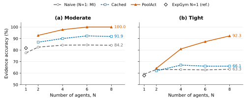
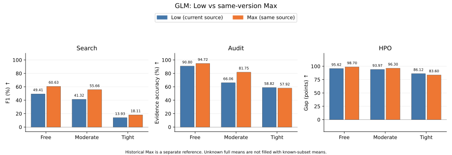
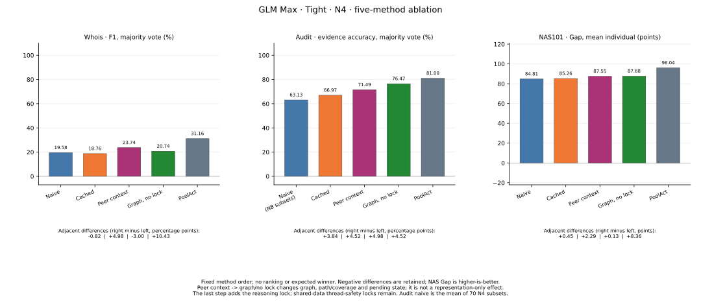

# 论文图件与 N=1 补充

[主报告](README.zh.md) · [详细报告](DETAILS.zh.md) · [逐点数据](figures/PLOT_DATA.csv) · [图件输入及输出 SHA](figures/FIGURE_INDEX.json) · [可复现绘图脚本](reproduce/plot_paper.py)

本次为冻结结果的图形修订：新增 naive scaling 的 N=1 派生点和已有 ExpGym Max N=1 参考点，重绘四张图。没有新增模型调用或重评分；原 210 设置表、1,334 个正式作业与成本不变。旧图保留在 Git 提交 `0389a9c69d5f3e21dc8c1ed0472a4df9ba2ca861` 和原本地存档中。

## N=1 的定义与可比性

| N=1 来源 | Moderate EA % | Tight EA % | 聚合与用途 |
| --- | ---: | ---: | --- |
| naive N8 的个体均分（MI） | 77.602 | 59.106 | 每文档8个agent原评分均值，再13文档等权；连接 naive 曲线 |
| 同版本 ExpGym Max | 81.750 | 57.919 | 每文档3种order先平均，再13文档等权；独立空心菱形参考 |

naive 的 N=1 点是同一个 naive N8 池已保存的个体评分均值 EA_MI；N≥2 仍为原 EA_MV。旧版个体评分器与投票器对答案格式的接受规则不同，因此没有将此点声称为重新计算的 singleton MV。直接复用已评分结果，不重新执行 vote/scorer；绘图脚本另核对13个文档级 N8 EA_MI 的均值。每预算104个个体分数来自13个池，不能当成104次独立实验，也没有新增成本。

ExpGym N1 和 scaling 都是同版本 GLM Max、相同13文档与反馈预算，但不是同一个运行设置：ExpGym 用3种显式 hypothesis order，scaling 采用默认标签顺序；ExpGym N1 无显式客户端 context cap，pool cap 为131072；seed与provider prompt-cache设置也不同。ExpGym参考点不与三条策略曲线相连。Cached/PoolAct没有实跑N1；即使只有一个agent，它们仍可能保留自身工具缓存或图状态，不能假定与naive重合。

## 1. Audit scaling



**Paper caption.** Agent scaling on evidence audit with GLM Max under Moderate and Tight budgets. Results are averaged equally over 13 documents. At N=1, Naive shows the mean of the eight stored individual agent scores in each observed eight-agent pool (EA-MI); no singleton re-voting is performed. At N=2/4/6/8, Naive shows EA-MV averaged over all 28/70/28/1 subsets of that pool. The legacy individual scorer and voter have different answer-format acceptance rules; the N=1 aggregation is therefore explicitly distinguished in the legend. Cached and PoolAct are measured at N=2/4/6/8. Open diamonds show separately executed ExpGym Max N=1 results, averaged over three hypothesis orders per document; differences in order, context limits and cache configuration make these reference points rather than common curve anchors. Per-agent budgets are fixed, so total pool budgets grow with N. The y-axis spans 50–104%; no confidence intervals over dependent subsets are implied.

## 2. 同版本 Low / Max



**Paper caption.** Low versus Max reasoning effort using the same execution and scoring version. Panels show Search F1 (73 questions), Audit evidence accuracy (13 documents, three orders each), and HPO normalized performance Gap (nine tasks, three repetitions each). All metrics are higher-is-better; Gap is expressed in points and is not capped at 100. Repetitions/orders are averaged within each item before equal weighting across items. Both efforts retain thinking. Runs were performed in successive batches, so the contrast is descriptive rather than a randomized causal estimate. “Mod.” denotes Moderate; bars start at zero. Exact values are provided in the accompanying table.

## 3. Tight N=4 消融



**Paper caption.** Coordination ablations with GLM Max at N=4 under Tight budgets. Naive, Cache, Peer, Graph, and PoolAct denote independent agents, shared tool caching, caching plus full visible peer action/result context, graph coordination without the outer reasoning/claim lock, and full PoolAct, respectively. Whois uses F1-MV across 39 questions; Audit uses EA-MV across 13 documents; NAS101 uses mean-agent Gap across three tasks, each with three repetitions. Audit naive N=4 is derived from all 70 subsets of each N=8 pool; other ablation naive runs execute N=4 directly. Each panel has its own zero-based scale. Peer-to-Graph replaces several coordination mechanisms and is not a pure formatting intervention; Graph retains internal data-structure locks. Decreases between intermediate variants are retained.

## 4. 历史次级参考


**Paper caption.** Secondary comparison of current Low with historical Max, using the user-designated historical rescoring snapshot (`2a78fc8`). Metrics, item weighting and budget labels match the same-version comparison. Execution, prompting and answer extraction/scoring versions differ across cohorts; these results must not be interpreted as a controlled effect of reasoning effort. The same-version comparison above is the primary analysis.

## 导出与复现

图宽统一7英寸，适合双栏通栏排版；实际尺寸下最小文字8 pt。使用色盲友好配色，线型、标记和填充纹理提供冗余区分；移除图内长脚注，保留准确轴单位、子图编号和简洁图例。所有柱形图从零起，scaling的局部纵轴明确标注。未新增显著性星号或把子集当独立重复计算误差条。

公开SVG为矢量路径，避免字体替换；本地同时导出嵌入TrueType字体的PDF与300 dpi PNG。PDF用于论文，PNG用于预览。具体投稿仍应匹配目标会议的版心尺寸，避免缩小后文字低于要求。

使用Python 3.11与Matplotlib 3.9.4，从仓库根目录执行：

```bash
python results/glm-followups-20260919/reproduce/plot_paper.py \
  --output-dir /tmp/glm-paper-figures --formats svg pdf png
```

脚本只读取两个SHA锁定的公开CSV，输出四张图、79个显示数值的`PLOT_DATA.csv`及`FIGURE_INDEX.json`；后者列出实际输入、生成器和图件身份。PDF/PNG保持本地，Git只发布SVG、脚本、逐点数据与说明。此次图形修订不被原55项成稿复核自动涵盖，另有一次针对新增点、图形和说明的有限独立复核。
