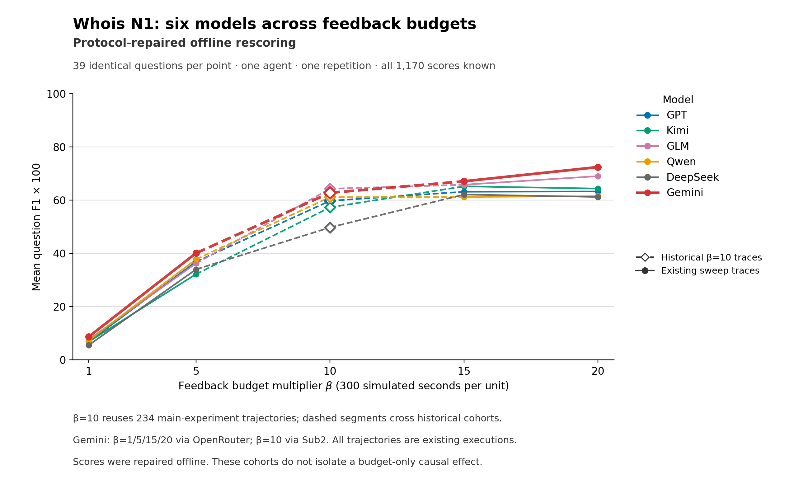
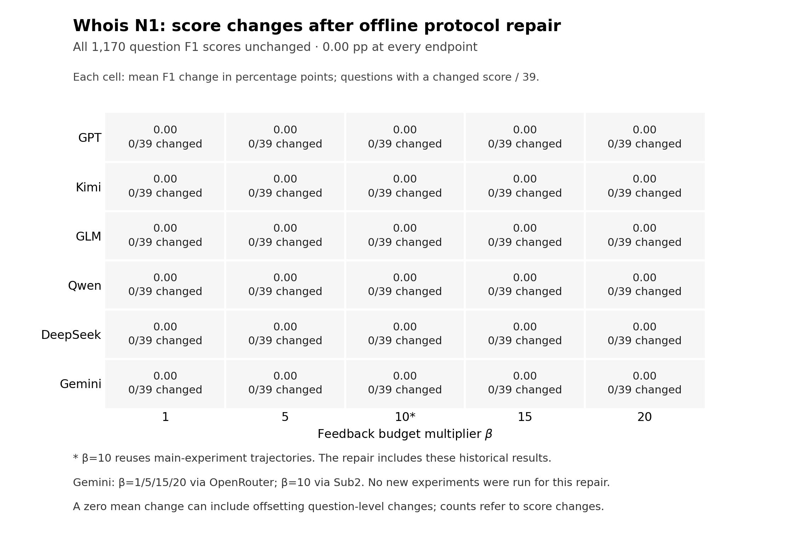

# 六模型 Whois N1：统一终答协议后的全量重评分

本版使用正式 `formal_protocol_repair_v1` 对全部 **1,170** 个既有位置的重评分结果重建分析。六模型 × β=1/5/10/15/20 × 39 题，N1、R1，分母不变；本报告构建没有新增模型调用，也没有改写原轨迹或旧报告。

共有 **2** 项最终答案提取变化、**0** 项 F1 变化；30 个模型×预算均值中 **0** 个变化，30 个排名位置中 **0** 个变化。答案文字变化不必然改变 F1。

| 模型 | β1 | β5 | β10（历史） | β15 | β20 |
| --- | ---: | ---: | ---: | ---: | ---: |
| GPT | 6.84 | 36.87 | 59.75 | 63.17 | 63.27 |
| Kimi | 6.84 | 32.19 | 57.30 | 65.20 | 64.35 |
| GLM | 7.69 | 36.25 | 64.28 | 65.79 | 69.03 |
| Qwen | 7.26 | 37.78 | 61.13 | 61.21 | 61.49 |
| DeepSeek | 5.56 | 33.99 | 49.75 | 62.11 | 61.21 |
| Gemini | 8.72 | 40.09 | 62.77 | 67.09 | 72.43 |

表中为逐题 F1 等权平均 ×100；CSV 保存 0–1 原值。每格 39/39 已评分；有效零分保留，不用已知子集代替完整均值。排名采用并列竞争排名，绝对差不超过 1e-12 视为并列。

## 与旧版的逐格差异

| 模型 | β | 旧 F1×100 | 新 F1×100 | 差值（百分点） | 分数变化题数 | 提取变化题数 |
| --- | ---: | ---: | ---: | ---: | ---: | ---: |
| GPT | 1 | 6.84 | 6.84 | +0.00 | 0 | 0 |
| GPT | 5 | 36.87 | 36.87 | +0.00 | 0 | 0 |
| GPT | 10 | 59.75 | 59.75 | +0.00 | 0 | 0 |
| GPT | 15 | 63.17 | 63.17 | +0.00 | 0 | 0 |
| GPT | 20 | 63.27 | 63.27 | +0.00 | 0 | 0 |
| Kimi | 1 | 6.84 | 6.84 | +0.00 | 0 | 0 |
| Kimi | 5 | 32.19 | 32.19 | +0.00 | 0 | 0 |
| Kimi | 10 | 57.30 | 57.30 | +0.00 | 0 | 1 |
| Kimi | 15 | 65.20 | 65.20 | +0.00 | 0 | 0 |
| Kimi | 20 | 64.35 | 64.35 | +0.00 | 0 | 0 |
| GLM | 1 | 7.69 | 7.69 | +0.00 | 0 | 0 |
| GLM | 5 | 36.25 | 36.25 | +0.00 | 0 | 0 |
| GLM | 10 | 64.28 | 64.28 | +0.00 | 0 | 0 |
| GLM | 15 | 65.79 | 65.79 | +0.00 | 0 | 0 |
| GLM | 20 | 69.03 | 69.03 | +0.00 | 0 | 1 |
| Qwen | 1 | 7.26 | 7.26 | +0.00 | 0 | 0 |
| Qwen | 5 | 37.78 | 37.78 | +0.00 | 0 | 0 |
| Qwen | 10 | 61.13 | 61.13 | +0.00 | 0 | 0 |
| Qwen | 15 | 61.21 | 61.21 | +0.00 | 0 | 0 |
| Qwen | 20 | 61.49 | 61.49 | +0.00 | 0 | 0 |
| DeepSeek | 1 | 5.56 | 5.56 | +0.00 | 0 | 0 |
| DeepSeek | 5 | 33.99 | 33.99 | +0.00 | 0 | 0 |
| DeepSeek | 10 | 49.75 | 49.75 | +0.00 | 0 | 0 |
| DeepSeek | 15 | 62.11 | 62.11 | +0.00 | 0 | 0 |
| DeepSeek | 20 | 61.21 | 61.21 | +0.00 | 0 | 0 |
| Gemini | 1 | 8.72 | 8.72 | +0.00 | 0 | 0 |
| Gemini | 5 | 40.09 | 40.09 | +0.00 | 0 | 0 |
| Gemini | 10 | 62.77 | 62.77 | +0.00 | 0 | 0 |
| Gemini | 15 | 67.09 | 67.09 | +0.00 | 0 | 0 |
| Gemini | 20 | 72.43 | 72.43 | +0.00 | 0 | 0 |

[逐题新旧分数](item_changes.csv) · [变化样本](affected_samples.csv) · [全部新旧均值](old_vs_new_metrics.csv) · [排名](rankings.csv) · [相对 β20 差值](budget_differences.csv) · [预算差值新旧对照](old_vs_new_budget_differences.csv)

## 来源与比较范围

β=10 的 **234** 个位置与主实验 N1 Moderate 完全重叠；已通过 `main_overlap_slot_id` 将原件身份及新 F1 逐项连接。跨主实验和 sweep 计数时，sweep 仅额外贡献 **936** 个位置，不能再把 β10 计算一遍。公开输入保留这 234 条主实验分数投影。

Gemini 的 β1/5/15/20 沿用 OpenRouter `google/gemini-3.8-flash` 的既有轨迹，β10 沿用历史 Sub2 Gemini native 轨迹。这是不同提供方/日期执行结果的描述性比较，不是同一部署只改变预算的实验。其他模型也保留原部署与代码版本边界。此次统一解析器重评分不能消除历史运行输入和交互路径的差异。

首次8个 Gemini sweep 结果仍对应原执行后的离线导出恢复；其余148个仍对应 schema 修复后的首次执行。两批执行/导出源码身份保留在 [adoption_sources.csv](adoption_sources.csv)，没有重新运行这156项。

β×300 为模拟反馈预算秒数，即300/1500/3000/4500/6000秒；seed2200、最多30步/30评价，N4 不进入该报告。姓名级 F1 的 gold 与计算公式未改；本版接入的是正式统一提取器的全量分数，不是抽查修正或诊断分数。

## 成本与行为边界

[agents.csv](inputs/agents.csv) 与 [attempts.csv](inputs/attempts.csv) 保持旧文件原字节。所有已发表 token、请求次数、模拟反馈费用、运行时长和原运行协议事件均照旧；历史 β10 的请求/token/wall time 未知仍为空，不能记零。Gemini 原8项的模型执行 wall time 未记录，仍为未知。

`aggregate_metrics.csv` 中 `missing_final_agents`、`protocol_affected_agents` 描述原运行事件；新的离线终答是否缺失见 `old_vs_new_metrics.csv` 的 `old_missing_final_items` / `new_missing_final_items`。重解析可能改变最终答案，不意味着原运行会在同一步停止；运行路径的反事实差异由统一重评分交付另列，不伪造新的调用量或成本。

## 图表



[PDF](figures/whois_six_model_budget.pdf) · [SVG](figures/whois_six_model_budget.svg)



[变化图 PDF](figures/whois_rescoring_delta.pdf) · [变化图 SVG](figures/whois_rescoring_delta.svg)

β10 用历史轨迹标记；跨历史点的连线保留虚线。图表全部从本版正式 CSV 重新生成；来源 SHA 与绘图脚本版本见 `figures/PROVENANCE.json`。

## 公开回放

本目录包含最小聚合输入，不依赖私有 raw、原工作目录或网络：

```bash
python3 -B build_report.py --bundle . --check
python3 -B build_report.py --bundle . --rebuild /path/to/new-empty-output
python3 -B plot_whois.py --bundle . --output-dir /path/to/new-empty-figures --source-version formal_protocol_repair_v1
```

前两条仅需 Python 标准库；绘图使用 matplotlib。聚合回放核验全部1,170项、234个主实验连接、30个均值/排名、24个预算差值及成本字段不变。正式 parser/scorer 从原终答文本到 F1 的全量回放由独立重评分工具负责，其源码 SHA 和回放收据复制在 `inputs/rescore_checks.json`、`inputs/score_replay_check.json`；本聚合器不冒充再次执行评分器。

[输入身份](INPUTS.json) · [检查结果](CHECKS.json) · [正式逐题评分投影](inputs/formal_score_rows.csv) · [Gemini 提供方](provider_cohorts.csv)
